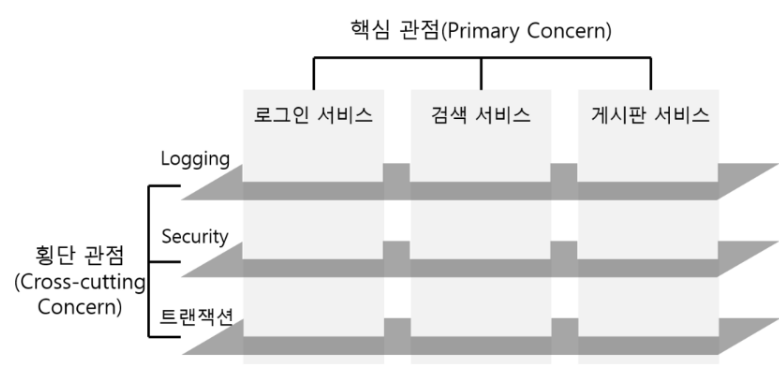
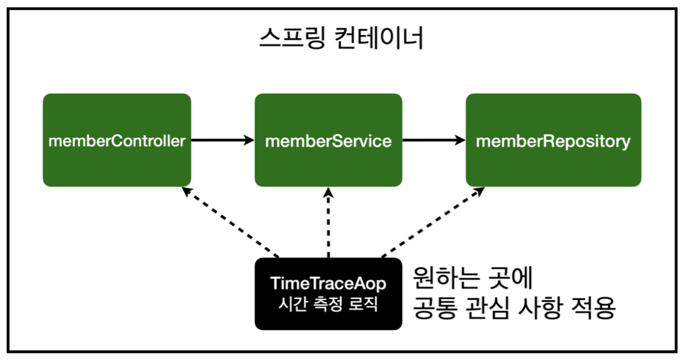
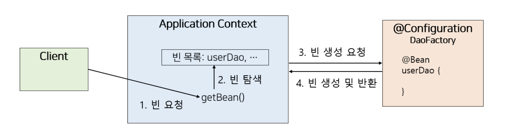

# spring-tutorial-20th
CEOS 20th BE Study - Spring Tutorial

---

## tutorial 을 하면서 발생한 issues ...

### 1. 개발 환경 세팅
- IDE 설치 : **IntelliJ IDEA** / Eclipse IDE / VSCode
- Java 17 or later
- Gradle 7.5+ / Maven 3.5+
- Postman : 필수적인 것은 아니지만 편의성을 위해 설치하였습니다

[spring boot Guide](https://spring.io/guides/gs/spring-boot) / 
[velog reference](https://velog.io/@uijeong/%ED%94%84%EB%A1%9C%EC%A0%9D%ED%8A%B8-%EC%8B%9C%EC%9E%91%ED%95%98%EA%B8%B0#-jdk-mavengradle-eclipse-%EC%84%A4%EC%B9%98%ED%95%98%EA%B8%B0)
### 2. java version 관련 build error
spring boot ver 3.0 부터는 Java 17 이상을 사용해야 한다고 해서 처음에 Java 22를 설치했다가 build error를 맞이했습니다. spring boot initializer에서 선택한 language에 맞추어 버전 설치하기!! 
### 3. 파일 구조 
Q1) `Test`, `TestController`, `TestRepository`, `TestService` class들이 test 폴더가 아닌 main 폴더에 있는 이유
- 원래 Test 파일들은 test 폴더에 있는게 맞는데, 간단한 tutorial이기 때문에 main폴더에 있는 것 뿐이라고 추정됩니다.

Q2) 만약 위의 파일들이 test 폴더에 있다면 TestController 파일을 실행하면 되는건가요?!

Q3) `com.ceos20.spring_boot` 폴더 내부에 넣는 것과 외부에 넣는 것에 어떤 차이가 있나요?
- 뒤에 4번에서 다시...
### 4. buile 후 `TestController`에서 HTTP Request를 보내고 실행했을 때 404 error
GET `http://localhost:8080/tests` 요청에 대해 404 error가 발생했습니다

`Application`을 실행했을 때 `@SpringBootApplication` 작업이 먼저 실행되게 되는데, 이 때 scan하는 component의 범위가 **같은 폴더**입니다!!! <br/>
따라서 `TestController` 내부 컴포넌트까지 scan되기 위해서는 해당 파일이 `com.ceos20.spring_boot`폴더 내에 (`Application`과 같은 폴더) 존재해야 합니다 - _3번의 Q3에 대한 답변_
### 5. h2-console 사용
h2 DB server에 접속하는 과정이 번거롭다고 느껴서, 로컬 서버를 실행하면 로컬에서 h2 DB를 확인할 수 있도록 `application.yml`에 spring 설정을 추가하였습니다.
```yaml
  spring:
    h2:
      console:
        enabled: true  # H2 Console을 사용할지 여부 (H2 Console은 H2 Database를 UI로 제공해주는 기능)
        path: /h2-console  # H2 Console의 Path
```
다음과 같이 설정하여 http://localhost:8080/h2-console 로 접속하여 로컬에서 h2 console을 사용하였습니다.

### 6. DB가 우선, 코드는 나중
h2 DB 서버에서 TEST table을 생성할 때 id나 name의 자료형을 자율적으로 설정할 수 있고, TEST 이외에 다른 table도 자유롭게 생성이 가능하다는 점을 확인했습니다.<br/>
코드를 보면 `TestController`의 기능이 DB에 있는 TEST 테이블을 가져오는 것이기 때문에 실제 DB에 id, name 외에 다른 column이 존재해도 무방합니다.<br/>

그렇다면 나아가서 백엔드 개발을 할 때, DB가 우선이 되고 그 데이터에 맞추어서 코드를 작성하는 것인가? 라는 궁금증으로 이어졌습니다.
```java
public class Test {
    @Id
    private Long id; // 이런 타입지정을 할 때, DB의 자료형을 확인한 후 맞춰서 지정하기
    private String name;
}
```
---

## spring이 지원하는 기술들(IoC/DI, AOP, PSA 등)

### _스프링은 왜 만들어졌는가?_ <br/>
> Java 기반의 프레임워크로, 좋은 **객체 지향** 어플리케이션을 개발할 수 있도록 만들어졌습니다. <br/>
> -- 추상화, 캡슐화, 상속, **다형성**



### 1. IoC (Inversion of Control)
```java
public class A {
    b = new B(); // class A에서 new로 B 객체 생성
}
```
위와 같이 클래스 내에서 객체를 직접 생성하는 것이 아니라
```java
public class A {
    private B b; // 외부에서 받아온 객체를 b에 할당
}
```
이처럼 외부에서 관리하고 있는 객체를 가져와서 사용하는 것을 제어의 역전이라고 합니다. 따라서 객체를 직접 생성하거나 제어하지 않습니다.

### 2. DI (Dependency Injection)
DI는 IoC를 실현하기 위한 방법 중 하나로 '의존성 주입'이라고도 합니다.
DI의 방식에는 다음과 같이 세가지가 있습니다.
- 생성자 주입
- setter 주입
- field 주입

### 3. AOP (Aspect-Oriented Programming)
여러 모듈에서 공통적으로 쓰이는 로직(code)을 주입하는 것
```java
@GetMapping("/get/{id}")
public String get(@PathVariable Long id, @RequestParam String name) {
	System.out.println("Get Method가 실행됨!");
	System.out.println("Get Method {id}: " + id);
	System.out.println("Get Method {name}: " + name);

	//서비스 로직
    
	return id + " " + name;
}

@PostMapping("/post")
public User post(@RequestBody User user) {
	System.out.println("Post Method가 실행됨!");
   	System.out.println("Post Method {user}: " + user);
        
	//서비스 로직
        
	return user;
}
```
이 코드에서 method 실행 정보를 알려주는 로직이 반복되기 때문에 AOP를 사용하여 분리해줄 수 있습니다.
```java
@Aspect
@Component
public class ParameterAop {

    //com/example/aop/controller 패키지 하위 클래스들 전부 적용하겠다고 지점 설정
    @Pointcut("execution(* com.example.aop.controller..*.*(..))")
    private void cut() {}

    //cut() 메서드가 실행 되는 지점 이전에 before() 메서드 실행
    @Before("cut()")
    public void before(JoinPoint joinPoint) {
		
        //실행되는 함수 이름을 가져오고 출력
        MethodSignature methodSignature = (MethodSignature) joinPoint.getSignature();
        Method method = methodSignature.getMethod();
        System.out.println(method.getName() + "메서드 실행");

        //메서드에 들어가는 매개변수 배열을 읽어옴
        Object[] args = joinPoint.getArgs();
		
        //매개변수 배열의 종류와 값을 출력
        for(Object obj : args) {
            System.out.println("type : "+obj.getClass().getSimpleName());
            System.out.println("value : "+obj);
        }
    }

    //cut() 메서드가 종료되는 시점에 afterReturn() 메서드 실행
    //@AfterReturning 어노테이션의 returning 값과 afterReturn 매개변수 obj의 이름이 같아야 함
    @AfterReturning(value = "cut()", returning = "obj")
    public void afterReturn(JoinPoint joinPoint, Object obj) {
        System.out.println("return obj");
        System.out.println(obj);
    }
}
```
```java
@GetMapping("/get/{id}")
public String get(@PathVariable Long id, @RequestParam String name) {
	//서비스 로직
	return id + " " + name;
}

@PostMapping("/post")
public User post(@RequestBody User user) {
	//서비스 로직
	return user;
}
```
이와 같이 AOP 클래스를 한번 작성하여 여러 개의 method에 적용할 수 있습니다.

### 4. PSA (Portable Service Abstraction)
`@Transactional` 과 같은 어노테이션을 선언하기만 하면 별도의 코드를 추가하지 않고도 트랜잭션 서비스를 사용할 수 있는데, 이것은 내부적으로 트랙잭션 코드가 추상화되어 숨겨져 있기 때문에 가능한 것 입니다. <br/>
이때 추상화 계층을 사용해서 기술을 내부에 숨기고 개발자에게 편의성을 제공해주는 것이 **Service Abstraction** 입니다.

DB에 접근하기 위해 jdbc를 이용할 수도 있고, ORM을 이용할 수도 있는데 모든 경우에서 `@Transactional` 어노테이션에 대한 기능은 유지됩니다.
이렇게 하나의 추상화로 여러가지 서비스를 모두 사용 가능하도록 한 것을 **Portable Service Abstraction**이라고 합니다.

---
## Spring Bean / Bean 의 라이프사이클

### 1. Spring Bean
> Bean은 스프링 컨테이너가 관리하는 재사용 가능한 자바 객체

- spring bean을 사용하는 이유<br/>
스프링 객체 사이의 의존관계 관리 !!
객체가 의존관계를 등록할 때 스프링 컨테이너에서 해당하는 빈을 찾고, 그 빈과 의존성을 만듭니다.
- spring bean 등록 방법
  - xml에 직접 등록
  - `@Bean` 어노테이션
  - `@Component`, `@Controller`, `@service`, `@Repository` 어노테이션 (클래스의 기능을 보여주어 가독성을 높이고, 사소한 기능의 차이때문에 구분하여 사용합니다)

### 2. Bean 의 라이프사이클
> 스프링 IoC 컨테이너 생성 → 스프링 빈 생성 → 의존관계 주입 → 초기화 콜백 메소드 호출 → 사용 → 소멸 전 콜백 메소드 호출 → 스프링 종료

1. 스프링 IoC 컨테이너 생성 → 스프링 빈 생성


2. 의존관계 주입<br/>
의존 관계를 주입하기 전 준비 단계가 존재하는데, 이때 객체의 생성이 일어납니다.
   - 생성자 주입 : 객체의 생성 + 의존 관계 주입 동시
   - setter, field 주입 : 객체의 생성 > 의존 관계 주입 순차적
3. 초기화 콜백 메소드 호출 → 사용 → 소멸 전 콜백 메소드 호출 → 스프링 종료<br/>
스프링의 **콜백 메소드** 관리방법 3가지
   - 인터페이스 (InitializingBean, DisposableBean)
   - 설정 정보에 초기화 메소드, 종료 메소드 지정
   - `@PostConstruct`, `@PreDestroy` 어노테이션 지원

[tistory reference](https://dev-coco.tistory.com/170)

## 스프링 어노테이션

---
### @SpringBootApplication
Spring Boot를 자동으로 실행시켜주는 어노테이션
- `@ComponentScan`을 통해 Component들을 Bean으로 등록
- `@EnableAutoConfiguration`을 통해 미리 정의해둔 자바 설정 파일들을 Bean으로 등록

### @ComponentScan
`@Component`, `@Service`, `@Repository`, `@Controller`, `@Configuration`이 붙은 빈들을 찾아 Context에 빈을 등록해주는 어노테이션

---

## 단위 테스트와 통합 테스트

### 1. 단위 테스트
소프트웨어 개발 과정에서 가장 작은 단위의 코드(함수, 메소드 등)를 대상으로 하는 테스트<br/>
각 단위가 개별적으로 정상적으로 동작하는지 확인하고자 하는 목적을 가집니다.

사용 시기 : 개발 초기 단계

장점 : <br/>
개발 초기 단계 버그 수정에 효과적입니다.<br/>
코드 수정이 다른 부분에 미치는 영향을 확인하는 데에 효과적입니다.

### 2. 통합 테스트
두 개 이상의 단위가 함꼐 잘 작동하는지 확인하는 테스트<br/>
단위 테스트에서 검증된 개별 단위들이 시스템 전체에서도 올바르게 동작하는지 확인하고자 하는 목적을 가집니다.

사용 시기 : 실행 시간이 길기 때문에 주로 개발 후반 단계에서 사용됩니다.

장점 : <br/>
시스템의 다양한 부분이 서로 올바르게 통신하는지, 데이터가 정확하게 전달되는지 등을 확인함으로써 소프트웨어의 품질을 보장합니다.