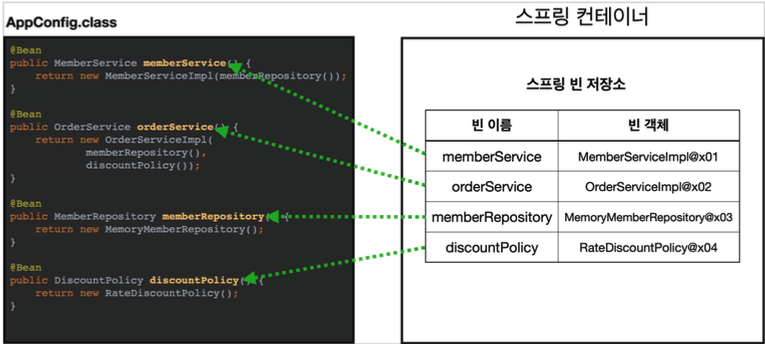

# spring-tutorial-20th
### CEOS 20th BE Study - Spring Tutorial (20th 문서영)
## 1️⃣ spring-boot-tutorial-20th 완료

### 튜토리얼 결과 - h2 연결 (mac)

> **맥 H2 실행 명령어**
>
>
> (base) seona@seonaui-MacBookAir ~ % ./desktop/h2/bin/h2.sh
>

> **H2DB TCP 모드로 서버 접속** ⭐
>
>
> JDBC URL : jdbc:h2:tcp://localhost/~/ceos20
>
> User Name : sa
>

테스트 데이터 입력은 h2 insert를 이용해 수기로 입력해주었다.

ex) INSERT INTO TEST~~


## 2️⃣ spring이 지원하는 기술들(IoC/DI, AOP, PSA 등)을 자유롭게 조사해요

**Spring 삼각형**

POJO(Plain Old Java Object)를 기반으로 하는 **IoC/DI**, **AOP**, **PSA** 의 스프링 3대 프로그래밍 모델을 스프링 삼각형이라고 한다.

| **IoC/DI** | 의존 역전/의존성 주입은  @Autowired나 XML 설정을 통해서 강합 결합을 느슨한 결합으로 변경해주며, 코드를 유연하게 해준다. |
| --- | --- |
| **AOP** | 관점 지향 프로그래밍으로서 공통된 로직을 추출하여 메소드의 다양한 시점에 실행할 수 있게 해줄수 있으며, 코드를 줄여주고, 개발자가 공통 로직을 배제하고 핵심 관심사에 집중할 수 있도록 해준다. |
| **PSA** | Portable Service Abstraction으로 일관성 있는 서비스 추상화이다. 서비스 추상화의 대표적인 예를 JDBC로 들수 있으며, 어떠한 데이터 베이스를 사용하더라도 일관성있는 방식으로 제어할 수 있도록 공통의 인터페이스를 제공하는 것이 서비스 추상화라고 한다. |

## **IoC/DI - 제어의 역전/의존성 주입**

스프링에서는 제어의 역전을 의존성 주입이라고도 한다. 이를 더 잘 이해하기 위해서는 **의존성**을 이해해야 한다.

### 의존성이란?

의존성은 어렵게 생각하지 않아도 단순하게 예를 들자면 다음과 같다.

**운전자는 자동차를 생산한다. = new Car()**

**자동차는 내부적으로 타이어를 생산한다. = Car 객체 생성자에서 new Tire();**

따라서 **new 라는 키워드는 의존성**이라 할 수 있다. Car 객체 생성자에서 new 를 실행함으로 Car가 Tire에 의존한다고 볼 수 있다. 이렇게 의존이라는 것은 전체가 부분에 의존하는 것을 표현하며, 좀 더 깊게 들어가서 의존 관계 사이를 집합 관계와 구성 관계로 구분할 수 있으며, 의존 관계를 어떻게 맺냐에 따라서 강합 결합이냐 느슨한 결합이냐를 이야기할 수 있게 된다.

| 집합 관계 | 부분이 전체와 다른 생성 주기를 가질 수 있다. |
| --- | --- |
| 구성 관계 | 부분은 전체와 같은 생명 주기를 갖는다. |

### **강한 결합**

**객체 내부에서 다른 객체를 생성하는 것**은 강한 결합도를 가지는 구조이다. A 클래스 내부에서 B 라는 객체를 직접 생성하고 있다면, B 객체를 C 객체로 바꾸고 싶은 경우에 A 클래스도 수정해야 하는 방식이기 때문에 강한 결합이다. 위에서도 동일하게 자동차 내부에서 타이어를 생성하는 것은 다른 타이어를 생성하고자 해도 코드를 수정해야 되는 상황이 발생한다.

### **느슨한 결합**

객체를 주입 받는다는 것은 **외부에서 생성된 객체를 인터페이스를 통해서 넘겨받는 것**이다. 이렇게 하면 결합도를 낮출 수 있고, 런타임시에 의존관계가 결정되기 때문에 유연한 구조를 가진다.

SOLID 원칙에서 O 에 해당하는 **Open Closed Principle** 을 지키기 위해서 디자인 패턴 중 전략패턴을 사용하게 되는데, **생성자 주입을 사용하게 되면 전략패턴을 사용**하게 된다.

> @Autowired나 XML 설정을 통해 강한 결합을 느슨한 결합으로 변경해주며, 코드를 유연하게 해준다.
>

## **객체의 주입?**

의존관계 주입은 크게 4가지 방법이 있다.

1. 생성자 주입
2. 수정자 주입 (setter 주입)
3. 필드 주입
4. 일반 메서드 주입

### 생성자 주입

생성자에 `@Autowired`: `@Component`를 통해 스프링 빈에 등록될 때 스프링 컨테이너가 해당 빈을 찾아 주입 해준다. 이름 그대로 생성자를 통해서 의존 관계를 주입 받는 방법이다.

- 특징
    - 생성자 호출시점에 딱 1번만 호출되는 것이 보장된다. → 이후 값을 변경 못 하게 막을 수 있다.
    - **불변, 필수** 의존관계에 사용
        - **불변**: 생성자를 통해서***만*** 의존관계가 주입되고, 이후 외부에서 수정할 수 없다.
            - 당연히 한번 설정한 후, setter 메서드를 만들면 안된다!
        - **필수**: 무조건 값이 있어야 한다.
            - private final로 필드에 지정을 했기에, 반드시 값이 있어야 한다.

```java
@Component
public class OrderServiceImpl implements OrderService {

    private final MemberRepository memberRepository;
    private final DiscountPolicy discountPolicy;

		// @Autowired
    public OrderServiceImpl(MemberRepository memberRepository, DiscountPolicy discountPolicy) {
        this.memberRepository = memberRepository;
        this.discountPolicy = discountPolicy;
    }
}
```

**중요!** *생성자가 딱 1개만 있으면 `@Autowired`를 생략해도 **자동 주입** 된다*. 물론 스프링 빈에만 해당한다.

### 수정자 (setter 주입)

`setter` 라 불리는 필드의 값을 변경하는 수정자 메서드를 통해서 의존관계를 주입하는 방법이다.

- 특징
    - **선택, 변경** 가능성이 있는 의존관계에 사용 (final 필드 X)
        - 선택: 스프링 빈으로 등록되지 않은 인스턴스도 주입 가능, `required = false`로 주입할 대상이 없어도 동작하게 할 수 있다.
        - 변경: 변경 가능성 있는 의존관계 사용시 중간에 setter를 호출해 의존관계를 변경 가능
    - 자바빈 프로퍼티 규약의 수정자 메서드 방식을 사용하는 방법이다.

```java
@Component
public class OrderServiceImpl implements OrderService {
    private MemberRepository memberRepository;
    private DiscountPolicy discountPolicy;

    @Autowired
    public void setMemberRepository(MemberRepository memberRepository) {
        this.memberRepository = memberRepository;
    }

    @Autowired
    public void setDiscountPolicy(DiscountPolicy discountPolicy) {
        this.discountPolicy = discountPolicy;
    }

		@Autowired
    public OrderServiceImpl(MemberRepository memberRepository, DiscountPolicy discountPolicy) {
        this.memberRepository = memberRepository;
        this.discountPolicy = discountPolicy;
    }
}
```

만약, 생성자와 수정자가 둘 다 존재한다면 기본적으로 스프링은 **생성자 의존관계 주입을 먼저 수행**한다. 이후, 수정자 의존관계 주입을 진행한다. (수정자가 있다면 생성자는 생략 가능, 싱글톤 원칙에 따라 생성자와 수정자에서 주입된 스프링 빈은 동일하다!)

이때, 당연히 @Autowired 애노테이션이 빠져있으면 스프링이 인식하지 못하기에 주입되지 않는다.

> **참고:** @Autowired 의 기본 동작은 주입할 대상이 없으면 오류가 발생한다. 주입할 대상이 없어도 동작하게 하려면 `@Autowired(required = false)` 로 지정하면 된다.
>

> **참고:** 자바빈 프로퍼티, 자바에서는 과거부터 필드의 값을 직접 변경하지 않고, setXxx, getXxx 라는 메서 드를 통해서 값을 읽거나 수정하는 규칙을 만들었는데, 그것이 **자바빈 프로퍼티 규약**이다.
>

**자바빈 프로퍼티 규약 예시**

```java
class Data {
    private int age;
    public void **setAge**(int age) {
      this.age = age;
    }
    public int **getAge**() {
      return age;
		}
}
```

### 필드 주입

이름 그대로 필드에 바로 주입하는 방법이다.

- 특징
    - 코드가 간결해서 많은 개발자들을 유혹하지만 **외부에서 변경이 불가능해서 테스트 하기 힘들다**는 치명적인 단점이 있다.
    - DI 프레임워크가 없으면 아무것도 할 수 없다. 순수한 자바 코드로 테스트 할 수 없다...
    - **사용하지 말자!** 아래와 같은 경우엔 사용해도 된다.
        - 애플리케이션의 실제 코드와 관계 없는 테스트 코드

          `@SpringBootTest` 등…

        - 스프링 설정을 목적으로 하는 `@Configuration` 같은 곳에서만 특별한 용도로 사용

```java
@Component
public class OrderServiceImpl implements OrderService {

	@Autowired
	private MemberRepository memberRepository;

	@Autowired
	private DiscountPolicy discountPolicy;
}
```

> 참고: 순수한 자바 테스트 코드에는 당연히 @Autowired가 동작하지 않는다. @SpringBootTest 처럼 스프링 컨테이너를 테스트에 통합한 경우에만 가능하다.
>

```java
@Bean
OrderService orderService(MemberRepository memberRepoisitory, DiscountPolicy discountPolicy) {
    new OrderServiceImpl(memberRepository, discountPolicy)
}
```

> 참고: 다음 코드와 같이 @Bean 에서 파라미터에 의존관계는 자동 주입된다. 수동 등록시 자동 등록된 빈의 의존관계가 필요할 때 문제를 해결할 수 있다.
>

### 일반 메서드 주입

일반 메서드를 통해서 주입 받을 수 있다.

- 특징
    - 한번에 여러 필드를 주입 받을 수 있다.
    - 일반적으로 잘 사용하지 않는다. (생성자/수정자 주입 내에 대부분 끝난다)

```java
@Component
public class OrderServiceImpl implements OrderService {
    private MemberRepository memberRepository;
    private DiscountPolicy discountPolicy;

		@Autowired
    public void init(MemberRepository memberRepository, DiscountPolicy discountPolicy) {
        this.memberRepository = memberRepository;
        this.discountPolicy = discountPolicy;
    }
}
```

> 참고: **의존관계 자동 주입은 스프링 컨테이너가 관리하는 스프링 빈이어야 동작한다**. 스프링 빈이 아닌 Member 같은 클래스에서 @Autowired 코드를 적용해도 아무 기능도 동작하지 않는다.
>

## 생성자 주입을 선택해라!

과거에는 수정자 주입과 필드 주입을 많이 사용했지만, 최근에는 스프링을 포함한 DI 프레임워크 대부분이 **생성자 주입을 권장**한다. 그 이유는 다음과 같다.

### **불변**

- 대부분의 의존관계 주입은 한번 일어나면 애플리케이션 종료시점까지 의존관계를 변경할 일이 없다. 오히려 대부분의 의존관계는 애플리케이션 종료 전까지 변하면 안된다. (불변해야 한다.)
- 수정자 주입을 사용하면, setXxx 메서드를 **public**으로 열어두어야 한다.
- 누군가 실수로 변경할 수도 있고, 변경하면 안되는 메서드를 열어두는 것은 좋은 설계 방법이 아니다.
- 생성자 주입은 객체를 생성할 때 딱 1번만 호출되므로 이후에 호출되는 일이 없다. 따라서 **불변하게 설계**할 수 있다.

### **누락**

프레임워크 없이 순수한 자바 코드를 단위 테스트 하는 경우에, 아래와 같이 **수정자 의존관계**인 경우

```java
public class OrderServiceImpl implements OrderService {
	private MemberRepository memberRepository;
	private DiscountPolicy discountPolicy;

	@Autowired
	public void setMemberRepository(MemberRepository memberRepository) {
	  this.memberRepository = memberRepository;
	}

	@Autowired
	public void setDiscountPolicy(DiscountPolicy discountPolicy) {
	  this.discountPolicy = discountPolicy;
	}
	//...
}
```

`@Autowired` 가 프레임워크 안에서 동작할 때는 의존관계가 없으면 오류가 발생하지만,

지금은 프레임워크 없이 순수한 자바 코드로만 단위 테스트를 수행하고 있다.

```java
@Test
void createOrder() {
    OrderServiceImpl orderService = new OrderServiceImpl();
    orderService.createOrder(1L, "itemA", 10000);
}
```

그런데 막상 실행 결과는 *NPE(Null Point Exception)* 이 발생하는데, `memberRepository`, `discountPolicy` 모두 **의존관계 주입이 누락**되었기 때문이다.

테스트를 작성할 때는, 의존관계가 잘 보이지 않지만 생성자 주입을 사용하면 다음처럼 주입 데이터를 누락했을 때 **컴파일 오류**가 발생한다. 그리고 IDE에서 바로 어떤 값을 필수로 주입해야 하는지 알 수 있다.

### final 키워드

생성자 주입을 사용하면 필드에 *final* 키워드를 사용할 수 있다.

그래서 **생성자에서 혹시라도 값이 설정되지 않는 오류를 컴파일 시점에 막아준다.**

```java
@Component
public class OrderServiceImpl implements OrderService {
	private final MemberRepository memberRepository;
	private final DiscountPolicy discountPolicy;

	@Autowired
	public OrderServiceImpl(MemberRepository memberRepository, DiscountPolicy discountPolicy) {
	this.memberRepository = memberRepository;
	}
	...
}
```

필수 필드인 `discountPolicy` 에 값을 설정해야 하는데, 이 부분이 누락되었다.

자바는 컴파일 시점에 다음 오류를 발생시킨다. 컴파일 오류는 세상에서 가장 빠르고, 좋은 오류다!

```java
java: variable discountPolicy might not have been initialized
```

> 참고: 수정자 주입을 포함한 나머지 주입 방식은 모두 생성자 이후에 호출되므로, 필드에 final 키워드를 사용할 수 없다.
>
>
> **오직 생성자 주입 방식만 *final* 키워드를 사용할 수 있다.**
>

### 정리

- 생성자 주입 방식을 선택하는 이유는 여러가지가 있지만, 프레임워크에 의존하지 않고, 순수한 자바 언어의 특징을 잘 살리는 방법이기도 하다.
- 기본으로 생성자 주입을 사용하고, 필수 값이 아닌 경우에는 수정자 주입 방식을 옵션으로 부여하면 된다. 생성자 주입과 수정자 주입을 동시에 사용할 수 있다.
- **항상 생성자 주입을 선택해라!** 그리고 가끔 옵션이 필요하면 수정자 주입을 선택해라. 필드 주입은 사용하지 않는 게 좋다.

## **AOP (Aspect-Oriented Programming) : 관점 지향 프로그래밍**

스프링의 DI가 의존성의 주입이라면 AOP는 코드 주입이라고 할 수 있다. 여러 모듈을 개발하다보면 모듈들에서 공통적으로 등장하는 로직이 존재한다. 예를 들어서 입금 출금 이체와 같은 부분에서 보안적인 부분이나 트랜잭션 로그를 남기고자 하는 코드 부분들이 분명히 공통적으로 등장할 것이다.

이렇게 공통적으로 등장하는 부분은 **횡단 관심사(cross-cutting concern)**이라고 한다. 일반적으로 코드는 **핵심 관심사 + 횡단 관심사**로 구성된다. 따라서 이러한 부분을 @Aspect 어노테이션을 통해서 추출하여 특정 메소드가 호출될 때 특정 시점에 동작하도록 할 수 있는 것이다.

이를 통해서 스프링이 얻고자 하는 부분은 어떤 것인가? 공통적으로 등장하는 횡단 관심사를 어느 한 사람이 잘 정의하여 코드를 작성했다면, 다른 개발자들은 이를 재사용할 수 있을 것이다. 이를 통해서 기존의 횡단 관심사를 계속해서 코딩해야 되는 불편함이 사라지고 오직 개발자들은 핵심 관심사에만 집중하여 개발을 할 수 잇게 되는 것이다. 또한 핵심 관심사에만 집중함으로 자연스럽게 SRP을 적용할 수 있게 된다.

### AOP 적용

**AOP**: Aspect Oriented Programming (관점 지향 프로그래밍)

**공통 관심 사항(cross-cutting concern) vs 핵심 관심 사항(core concern) 분리**


```java
package seona.hellospring.aop;

import org.aspectj.lang.ProceedingJoinPoint;
import org.aspectj.lang.annotation.Around;
import org.aspectj.lang.annotation.Aspect;
import org.springframework.stereotype.Component;

@Aspect
@Component
public class TimeTraceAop {

    @Around("execution(* seona.hellospring..*(..))") //타겟을 적용시킬 수 있음.
    public Object execute(ProceedingJoinPoint joinPoint) throws Throwable{
        long start = System.currentTimeMillis();
        System.out.println("Start : "+joinPoint.toString());
        try {
            return joinPoint.proceed();
        } finally {
            long finish = System.currentTimeMillis();
            long timeMs = finish-start;
            System.out.println("End : "+joinPoint.toString()+" "+ timeMs+"ms");
        }
    }
}
```

Aop 패키지를 만들어서 원하는 공통 관심 사항을 메소드로 만든다. 이후, Around를 통해 타겟을 적용 후 코드를 실행하면 하나하나 코드를 만들 필요 없이 타겟 메소드에 해당 관심 사항을 적용할 수 있다.

### 해결

- 회원가입, 회원 조회등 핵심 관심사항과 시간을 측정하는 공통 관심 사항을 분리한다.
- 시간을 측정하는 로직을 별도의 공통 로직으로 만들었다.
- 핵심 관심 사항을 깔끔하게 유지할 수 있다.
- 변경이 필요하면 이 로직만 변경하면 된다.
- 원하는 적용 대상을 선택할 수 있다.

## **PSA (Portable Service Abstraction) : 일관성 있는 서비스 추상화**

PSA는 일관성있는 추상화이다. 서비스 추상화의 대표적인 예로 JDBC를 두는데 이러한 표준 스펙 덕분에 개발자는 오라클을 사용하든, MySQL을 사용하든, MS-SQL을 사용하던 어떠한 데이터베이스를 사용하던 공통된 방식으로 코드를 작성할 수 있다. 데이터베이스 종류에 관계없이 같은 방식으로 제어할 수 있는 이유는 디자인 패턴에서 설명했던 어댑터 패턴을 활용했기 때문이다. 이처럼 어댑터 패턴을 적용해 같은 일을 하는 다수의 기술을 공통의 인터페이스로 제어할 수 있게 한 것을 서비스 추상화라고 한다.

> **Reference**
>
>
> https://guy-who-writes-sourcecode.tistory.com/40
>
> 김영한 - 스프링 핵심원리 강의

## 3️⃣ Spring Bean 이 무엇이고, Bean 의 라이프사이클은 어떻게 되는지 조사해요

### 스프링 빈이란?

빈(Bean)은 **스프링 컨테이너에 의해 관리되는 재사용 가능한 소프트웨어 컴포넌트**이다.

즉, 스프링 컨테이너가 관리하는 자바 객체를 뜻하며, 하나 이상의 빈(Bean)을 관리한다. 빈은 인스턴스화된 객체를 의미하며, 스프링 컨테이너에 등록된 객체를 스프링 빈이라고 한다.

`@Bean` 어노테이션을 통해 메서드로부터 반환된 객체를 스프링 컨테이너에 등록한다. 빈은 클래스의 등록 정보, Getter/Setter 메서드를 포함하며, 컨테이너에 사용되는 설정 메타데이터로 생성된다.

### 스프링 빈의 라이프 사이클

Spring의 Bean은 Java 또는 XML bean 정의를 기반으로 IoC 컨테이너가 시작될 때 인스턴스화 되어야 한다. Bean을 사용 가능한 상태로 만들기 위해 사전, 사후 초기화 단계를 수행해야 할 수 있다. 그 후 Bean이 더 이상 필요하지 않으면 IoC Container에서 제거된다. 다른 시스템 리소스를 해제하기 위해 사전 및 사후 소멸 단계를 수행해야 할 수 있다.

> **Bean Life cycle**이란 해당 객체가 언제 어떻게 생성되어 소멸되기 전까지 어떤 작업을 수행하고 언제, 어떻게 소멸되는지 일련의 과정을 이르는 말이다.
>

Spring Container는 이런 빈 객체의 생명주기를 컨테이너의 생명주기 내에서 관리하고, 생성이나 소멸 시 호출될 수 있는 콜백 메서드를 제공하고 있다.

### Spring Bean Life Cycle 흐름 정리

1. 스프링 컨테이너 생성
2. 스프링 빈 생성
3. 의존성 주입
4. 초기화 콜백 : 빈이 생성되고, 빈의 의존관계 주입이 완료된 후 호출
5. 사용
6. 소멸전 콜백 :빈이 소멸되기 직전에 호출
7. 스프링 종료

### Spring bean Life Cycle Call back

1. 인터페이스 (InitializaingBean, DisposableBean)

    ```java
    public class Example1 implements InitialzingBean, DisposableBean {
    	```
        @Override
        public void afterPropertiestSet() throws Exception {
        	// 초기화 로직
        }
    
        @Override
        public void destory() throws Exception {
        	// 객체 소멸 로직 (메모리 회수, 연결 종료 등)
        }
    }
    ```

   단점 : 코드를 고칠 수 없는 외부 라이브러리에 적용 불가능

2. **설정 정보에 초기화 메소드, 종료 메소드 지정**

   인터페이스를 구현하는 것이 아니라 @Bean Anootation에 initmethod,destroyMehod를 속성으로 초기화 하여 각각 지정한다.

    ```java
    public class ExampleBean {
        public void init() throws Exception {
        	//초기화 콜백
        }
    
        public void close() throws Exception {
            // 소멸 전 콜백
        }
    }
    
    @Configuration
    class LifeCycleConfig {
    	 @Bean(initMethod = "init", destroyMethod = "close")
         public ExampleBean exampleBean() {
    
         }
    }
    
    ```

   위 방법은 위에 명시한 두 인터페이스를 구현시킬 수 없는 클래스의 객체를 스프링 컨테이너에 등록할 때 유용하다.

   메소드 명을 자유롭게 부여할 수 있고, 스프링 코드에 의존하지 않는다.

   설정 정보를 사용하기 때문에 코드를 고칠 수 없는 외부 라이브러리에도 초기화 종료 메서드를 적용할 수 있다.

3. **@PostConstruct, @PreDestroy annotiation 사용**
    - `@PostConstruct`: 기본 생성자를 사용하여 빈이 생성된 후 인스턴스가 요청 객체에 반환되기 직전에 주석이 달린 메서드가 호출됩니다.
    - `@PreDestroy` : @PreDestroy주석이 달린 메소드는 bean이 bean 컨테이너 내부 에서 파괴되기 직전에 호출됩니다 .

    ```java
    import javax.annotation.PostConstruct;
    import javax.annotation.PreDestroy;
    
    public class DemoBean
    {
    	@PostConstruct
    	public void customInit()
    	{
    		System.out.println("Method customInit() invoked...");
    	}
    
    	@PreDestroy
    	public void customDestroy()
    	{
    		System.out.println("Method customDestroy() invoked...");
    	}
    }
    
    ```

   최신 스프링에서 **가장 권장하는 방법**으로 애노테이션 하나만 붙이면 되므로 매우 편리.

   패키지를 잘 보면 javax.annotation.PostConstruct 로 스프링에 종속적인 기술이 아니라 JSR-250 라는 자바 표준이다. 따라서 스프링이 아닌 다른 컨테이너에서도 동작한다.

   유일한 단점은 외부 라이브러리에는 적용하지 못한다는 점.


### 스프링 빈 조회 (메타데이터)

```java
@Bean
	public CommandLineRunner commandLineRunner(ApplicationContext context) {
		return args -> {
			System.out.println("Let's inspect the beans provided by Spring Boot:");

			// Spring Boot 에서 제공되는 Bean 확인
			String[] beanNames = context.getBeanDefinitionNames();
			Arrays.sort(beanNames);
			for (String beanName : beanNames) {
				System.out.println(beanName);
			}
		};
	}
```

- 스프링 컨테이너 **`ApplicationContext`**
    - `ApplicationContext` 를 스프링 컨테이너라 한다.

  

  기존에는 개발자가 AppConfig 를 사용해서 직접 객체를 생성하고 DI를 했지만, 이제부터는 스프링 컨테이너를 통해서 관리해줄 수 있다.

  스프링 컨테이너는 `@Configuration` 이 붙은 `AppConfig` 를 설정(구성) 정보로 사용한다. 여기서 `@Bean` 이라 적힌 메서드를 모두 호출해서 반환된 객체를 스프링 컨테이너에 등록한다. 이렇게 스프링 컨테이너에 등록된 객체를 **스프링 빈**이라 한다.

  이때, 스프링 빈은 @Bean 이 붙은 메서드의 명을 스프링 빈의 이름으로 사용한다. ( memberService, orderService ) 스프링 컨테이너에 객체를 스프링 빈으로 등록 하고, 스프링 컨테이너에서 스프링 빈을 찾아서 사용할 수 있다.

    - **(정리) Bean 요청시 처리 과정**
        1. ApplicationContext는 @Configuration이 붙은 클래스들을 설정 정보로 등록해두고, @Bean이 붙은 메소드의 이름으로 빈 목록을 생성한다.(**서비스 실행**)
        2. 클라이언트가 **해당 Bean을 요청한**다.
        3. ApplicationContext는 자신의 **빈 목록에서 요청한 이름이 있는지 찾는다**.
        4. ApplicationContext는 **설정 클래스로부터 빈 생성을 요청하고, 생성된 빈을 반환한다**.
    - **조회를 위한 메서드**
        - 빈 이름 조회

          **`ac.getBeanDefinitionNames();`** : 스프링에 등록된 모든 빈 이름을 조회

        - 빈 객체 조회

          **`ac.getBean(빈이름, 타입)`** : 빈 인스턴스 조회

          **`ac.getBean(타입)`** : 빈 인스턴스 조회(같은 타입의 스프링 빈이 둘 이상이면 예외 발생)

          **`ac.getBeansOfType(타입)`** : 해당 타입의 모든 빈 조회

          **`getRole()`** : 스프링 내부에서 사용하는 빈과 사용자가 등록한 빈을 구분할 수 있다.

          **`BeanDefinition.ROLE_APPLICATION`** : 일반적으로 사용자가 정의한 빈

          **`BeanDefinition.ROLE_INFRASTRUCTURE`** : 스프링이 내부에서 사용하는 빈


> Reference
>
>
> 김영한 - 스프링 핵심원리 강의
>
> [https://velog.io/@gehwan96/Spring-Boot-ApplicationContext에-대해-알아보자](https://velog.io/@gehwan96/Spring-Boot-ApplicationContext%EC%97%90-%EB%8C%80%ED%95%B4-%EC%95%8C%EC%95%84%EB%B3%B4%EC%9E%90)
>
> https://ittrue.tistory.com/221
>
> https://velog.io/@hosunghan0821/Spring-Spring-bean-life-cycle
>